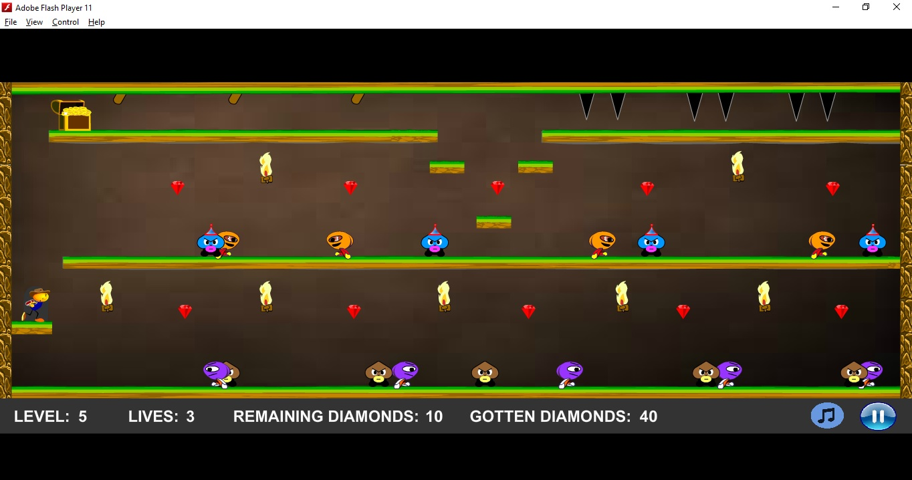

# THE DIAMONDS AND TREASURE

* Purpose: My CS-20 Thesis
* Programming Language: Action Script 3.0
* IDE: Adobe Flash Professional CS6
* Target: Flash Player 9
* Type of Application: Desktop Application (Platform Game with a short story)
  
<h2> User Interface Screenshots </h2> 
  
  
  
  
  
  
  
  
  
	
  
	  
  
				  
  
  
  

  
	
  
  
  
  